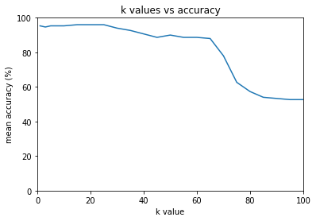

This is an implementation of k_Nearest neighbors using only the most basic python libraries. k-Nearest neighbors is a relatively simple algorithm that is supervised (thus attempts to predict a target variable). However k-Nearest neighbors does not require a training period and it is not parameterized, meaning we don't need to define the training features ahead of time. It takes an instance of data and attempts to predict the target variable by looking at a set of the nearest neighbors (number of neighbors is equal to a variable that we set i.e. k) to that instance. 

We will test this against the popular Iris Dataset

In addition to the above benefits for this algorithm, it is also sometimes used for simple recommendation engines by returning the neighbors for a particular instance. One major downside of the algorithm is that it is computationally expensive.

Thanks to machinelearningmastery.com for this walkthrough:
https://machinelearningmastery.com/tutorial-to-implement-k-nearest-neighbors-in-python-from-scratch/

## Import Libraries


```python
from csv import reader
from math import sqrt
from random import seed
from random import randrange
from copy import deepcopy
```


```python
from matplotlib import pyplot as plt
```

## Create k-Nearest Neighbors prediction


```python
# assume that the last column is the target variable
def euclidean_distance(row1, row2):
    distance = 0.0
    for i in range(len(row1)-1):
        distance+=(row1[i] - row2[i])**2
    return sqrt(distance)
```


```python
def get_k_neighbors(train, instance, k):
    distances = []
    for row in train:
        dist = euclidean_distance(row, instance)
        distances.append((row, dist))
    distances.sort(key=lambda tup: tup[1])
    neighbors = []
    for i in range(k):
        neighbors.append(distances[i][0])
    return neighbors
```


```python
def predict_k_neighbors(train, instance, k):
    neighbors = get_k_neighbors(train, instance, k)
    output_values = [row[-1] for row in neighbors]
    prediction = max(set(output_values), key=output_values.count)
    return prediction
```


```python
def k_nearest_neighbors(train, to_predict, k):
    predictions = []
    col_mins = []
    col_maxs = []
    for i in range(len(train[0])-1):
        values_in_col = [row[i] for row in train]
        col_min = min(values_in_col)
        col_max = max(values_in_col)
        col_mins.append(col_min)
        col_maxs.append(col_max)
    train_norm = deepcopy(train)
    for row in train_norm:
        for i in range(len(row)-1):
            row[i] = (row[i] - col_mins[i])/(col_maxs[i] - col_mins[i])
    to_predict_norm = deepcopy(to_predict)
    for row in to_predict_norm:
        for i in range(len(row)-1):
            row[i] = (row[i] - col_mins[i])/(col_maxs[i] - col_mins[i])
        output = predict_k_neighbors(train_norm, row, k)
        predictions.append(output)
    return(predictions)
```

## Test algorithm against Iris Dataset


```python
dataset = []
with open('iris.csv', 'r') as file:
    csv_reader = reader(file)
    for row in csv_reader:
        if not row:
            continue
        for i in range(len(row)-1):
            row[i] = float(row[i])
        dataset.append(row)
```


```python
dataset[:5]
```


    [[5.1, 3.5, 1.4, 0.2, 'Iris-setosa'],
     [4.9, 3.0, 1.4, 0.2, 'Iris-setosa'],
     [4.7, 3.2, 1.3, 0.2, 'Iris-setosa'],
     [4.6, 3.1, 1.5, 0.2, 'Iris-setosa'],
     [5.0, 3.6, 1.4, 0.2, 'Iris-setosa']]


```python
def evaluate_algorithm(dataset, algorithm, n_folds, *args):
    folds = cross_validation_split(dataset, n_folds)
    scores = []
    for validation_fold in folds:
        train_set = [row for row in dataset if not(row in validation_fold)]
        predicted = algorithm(train_set, validation_fold, *args)
        actual = [row[-1] for row in validation_fold]
        accuracy = accuracy_metric(actual, predicted)
        scores.append(accuracy)
    return scores
```


```python
def cross_validation_split(dataset, n_folds):
    dataset_folds = []
    dataset_copy = dataset.copy()
    fold_size = int(len(dataset_copy)/n_folds)
    for _ in range(n_folds):
        fold = []
        while len(fold) < fold_size:
            rand_index = randrange(len(dataset_copy))
            fold.append(dataset_copy.pop(rand_index))
        dataset_folds.append(fold)
    return dataset_folds
```


```python
def accuracy_metric(actual, predicted):
    correct = 0
    for i in range(len(actual)):
        if actual[i] == predicted[i]:
            correct+=1
    return correct / float(len(actual)) * 100.0
```


```python
seed(123)
scores = evaluate_algorithm(dataset, k_nearest_neighbors, 5, 5)
print(f'Scores: {scores}')
print(f'Mean Accuracy: {sum(scores)/float(len(scores)):.2f}')
```

    Scores: [96.66666666666667, 96.66666666666667, 90.0, 93.33333333333333, 100.0]
    Mean Accuracy: 95.33


## Test various k values


```python
# using cross validation (with 5 folds) to test different k values
k_values = [1,3]
k_values.extend([5*i for i in range(1,21)])
mean_accuracies = {}
for k in k_values:
    seed(123)
    scores = evaluate_algorithm(dataset, k_nearest_neighbors, 5, k)
    mean_accuracies[k] = sum(scores)/float(len(scores))
for k, ma in mean_accuracies.items():
    print(f'{k}: {ma:.2f}%')
```

    1: 95.33%
    3: 94.67%
    5: 95.33%
    10: 95.33%
    15: 96.00%
    20: 96.00%
    25: 96.00%
    30: 94.00%
    35: 92.67%
    40: 90.67%
    45: 88.67%
    50: 90.00%
    55: 88.67%
    60: 88.67%
    65: 88.00%
    70: 78.00%
    75: 62.67%
    80: 57.33%
    85: 54.00%
    90: 53.33%
    95: 52.67%
    100: 52.67%


```python
x = [item[0] for item in mean_accuracies.items()]
y = [item[1] for item in mean_accuracies.items()]
plt.figure()
plt.plot(x, y)
plt.xlabel('k value')
plt.ylabel('mean accuracy (%)')
plt.axis([0, 100, 0, 100])
plt.title('k values vs accuracy')
plt.show()
```



